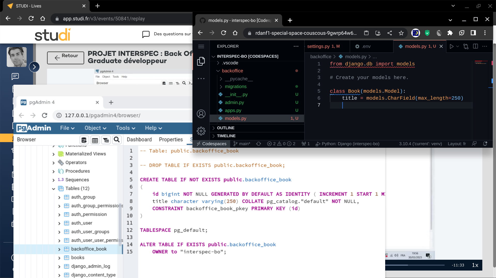
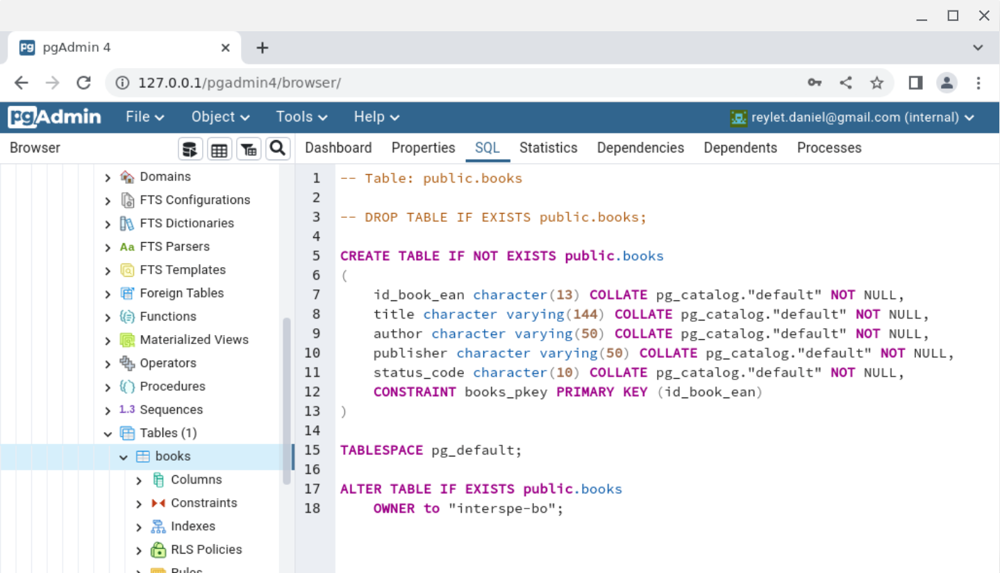

# interspec-bo
Interspec Studi Backoffice python django
Lead : Majd

<h3>I)  
After venv creation on existing project</h3>
<menus>
- File -> Settings -> Project -> Python Interpreter 
- ADD Python Interpreter 
- etc... 
</menus>
 
<h3>II) 
Open a Terminal then :</h3>
<code>
$ pip install django
</code>
 
<h3>III)
Start/Initialize new django project :</h3> 
<code>
- $ django-admin startproject interspecbo
- $ cd interspecbo
- $ python manage.py runserver 127.0.0.1:8200
- $ git init 
- etc...
</code>

******************************************************

One directory too high for the repo ?!.. 
     ( in python project package )  
     
[django tutorial 01](https://docs.djangoproject.com/en/4.1/intro/tutorial01/)

<h3>
codespace speaking : I MEAN OPENED IN BROWSER CODESPACE
</h3>
                     ***** THAT'S REAL FUN (LYNY) *****

<h3>Live 3 : backoffice app bookmodel ok</h3>

<h3>My version of the book table - writen with pdadmin4 : BAD</h3>
<h2>TODO : rewrite with model in models.py of backoffice app</h2>

<code>
NB: I have 70 hours remaining for codespace 'til 1 of April !!! (using 4 cores 8M ram actually )
</code>
